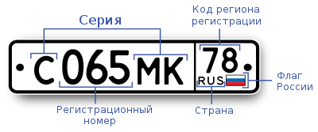

## Автомобильный номер

В службе по дорожному движению решили оптимизировать процесс создания автомобильных номеров:
вместо человека генерацию автомобильных номеров поручили некоторой GPT (модели машинного обучения).
Как мы знаем, искусственный интеллект ещё сыроват и делает много ошибок, поэтому его результаты следует тщательно проверять.
Корректный автомобильный номер (в России) имеет следующий формат:

Напишите программу, которая принимает на вход строку и проверяет, является ли эта строка корректным автомобильным номером.
Программа должна вывести сообщение о том, справился ли искусственный интеллект со своей задачей.
В нашей задаче корректным автомобильным номером будем считать следующие форматы:

    <БУКВА><ЦИФРА><ЦИФРА><ЦИФРА><БУКВА><БУКВА>_<ЦИФРА>
    <БУКВА><ЦИФРА><ЦИФРА><ЦИФРА><БУКВА><БУКВА>_<ЦИФРА><ЦИФРА><ЦИФРА>

где <ЦИФРА> – это любая цифра, а <БУКВА> – это одна из букв кириллицы АВЕКМНОРСТУХ.

 

### *Тестовые данные:*

| Номер теста | Входные данные           | Выходные данные |
|:-----------:|--------------------------|-----------------|
|      1      | А123ВС_45                | YES             |
|      2      | АЯ123В_45                | NO              |
|      3      | Please, try again later. | NO              |
|      4      | Н142МВ_456               | YES             |
|      5      | У173РВ_02                | YES             |
|      6      | ЭЮЯ987_15                | NO              |
|      7      | Н000ЕТ777                | NO              |
|      8      | К745ОК_12Я               | NO              |
|      9      | к147ау_159               | NO              |
|     10      | К147АУ_159               | YES             |
|     11      | Г14ИПЕ_59                | NO              |
|     12      | НМВ10_105                | NO              |
|     13      | П152АУ_10                | NO              |
|     14      | У477ЦЯ_193               | NO              |
|     15      | А962СН_1                 | NO              |
|     16      | ERROR                    | NO              |
|     17      | Й96СН_1023               | NO              |
|     18      | А864СН_1085              | NO              |
|     19      | Х040СФ_59                | NO              |
