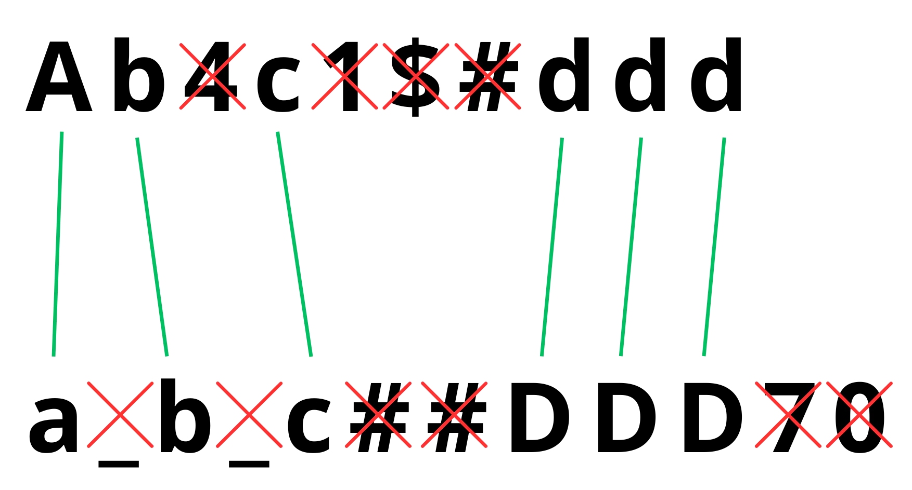

## Необычное сравнение

На вход программе подаются 2 строки. Вам необходимо сравнить эти строки посимвольно, не учитывая регистр и игнорируя все небуквенные символы.
Программа должна вывести сообщение о том, равны ли строки в результате такой проверки.

**Примечание.** Разберём 1-й тест:

 

### *Тестовые данные:*

| Номер теста | Входные данные                                        | Выходные данные |
|:-----------:|-------------------------------------------------------|-----------------|
|      1      | Ab4c1$#ddd a_b_c##DDD70                            | YES             |
|      2      | n5#e6vER +NEV-er                                   | YES             |
|      3      | с-э-м С-Э-Э-М                                      | NO              |
|      4      | -r-u-s-s-i-a- R+U+S+S+I+A                          | YES             |
|      5      | e==C=/I(k)A E__ci/33336996-a                       | NO              |
|      6      | TIMUR🔥 timur😎                                    | YES             |
|      7      | scorpion🦂 scorpion_666K                           | NO              |
|      8      | Душнила_best__ душнила --- BEST____                | YES             |
|      9      | p___yth589on +*/python45                           | YES             |
|     10      | поколение python ПОКОЛЕНИЕ PYTHON                  | YES             |
|     11      | perm perm                                          | YES             |
|     12      | Still don't know my name still do not know my name | NO              |
|     13      | Hello,     world!!!! helloworld                    | YES             |
|     14      | ++exa/-mple /*exa++mple                            | YES             |