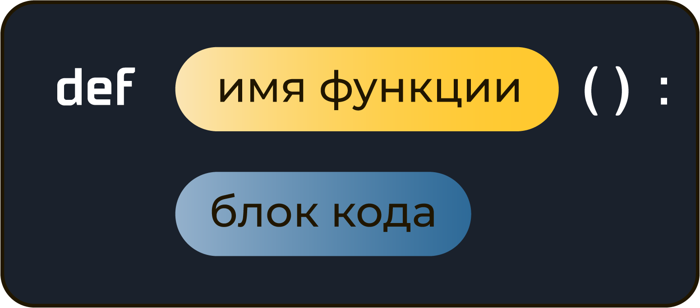

# "Поколение Python": курс для начинающих

## Содержание

<a href="#h22">2.2. Команды print и input</a> 
<a href="#h24">2.4. Целочисленная арифметика. Часть 1</a> 
<a href="#h25">2.5. Целочисленная арифметика. Часть 2</a> 
<a href="#h41">4.1. Выбор из двух</a> 
<a href="#h42">4.2. Логические операции</a> 
<a href="#h61">6.1. Числовые типы данных: int, float</a> 
<a href="#h62">6.2. Строковый тип данных</a> 
<a href="#h63">6.3. Модуль math</a> 
<a href="#h71">7.1. Цикл for</a> 
<a href="#h72">7.2. Цикл for: функция range</a> 
<a href="#h73">7.3. Частые сценарии</a> 
<a href="#h74">7.4. Цикл while</a> 
<a href="#h76">7.6. break, continue и else</a> 
<a href="#h91">9.1. Индексация</a> 
<a href="#h92">9.2. Срезы</a> 
<a href="#h93">9.3. Методы строк</a> 
<a href="#h96">9.6. Форматирование строк</a> 
<a href="#h97">9.7. Строки в памяти компьютера, таблица символов Unicode</a> 
<a href="#h111">11.1. Введение в списки</a> 
<a href="#h112">11.2. Основы работы со списками</a> 
<a href="#h113">11.3. Методы списков</a> 
<a href="#h114">11.4. Вывод элементов списка</a> 
<a href="#h115">11.5. Методы строк: split, join</a> 
<a href="#h117">11.7. Списочные выражения</a> 
<a href="#h118">11.8. Сортировка списков</a> 
<a href="#h131">13.1. Функции без параметров</a> 

## 2. Ввод-вывод данных

### 2.2. *Команды print и input*

<code>print()</code> - выводит данные на экран (в консоль)

<code>print(data1, [data2], ..., [dataN], [sep=' '], [end = '\n'])</code> - полная запись 
<code>data1-dataN</code> - данные, которые нужно вывести на экран. 
<code>sep</code> - разделитель, который ставится между аргументами (по умолчанию равен пробелу - ' '). Необязательный параметр. 
<code>end</code> - определяет, что нужно поставить в конце вывода (по умолчанию равен символу перевода строки - '\n' ). Необязательный параметр.

*Примеры:*

<code>print('Python')</code> 
<code>print('Я', 'учусь', 'программировать', 'на', 'Python!')</code> 
<code>print(24)</code> 
<code>print()</code>

---

<code>input()</code> - считывает данные, введённые с клавиатуры

*Примеры:*

<code>input()</code> 
<code>nput('Введи что-нибудь: ')</code>

---

Переменные - "области в памяти", которые мы для нашего удобства можем назвать каким-то именем.

1. В имени переменной рекомендуется использовать только латинские буквы a-z, A-Z, цифры и символ нижнего подчеркивания (_);
2. Имя переменной не может начинаться с цифры;
3. Имя переменной не может содержать пробелы;
4. Имя переменной по возможности должно отражать ее назначение.

*Примеры:*

<code>s = 'строка'</code> 
<code>n = 12</code> 
<code>name = input('Введи своё имя: ')</code> 
<code>name, surname = input('Введи своё имя: '), input('Введи свою фамилию: ')</code>

### 2.4. *Целочисленная арифметика. Часть 1*

*Основные операции с числами:* 
<code>a = 4</code> 
<code>b = 2</code> 
<code>+</code> - сложение (a + b) 
<code>-</code> - вычитание (a - b) 
<code>*</code> - умножение (a * b) 
<code>/</code> - деление (a / b)

---

<code>int()</code> - преобразует строку к целому числу

<code>str()</code> - преобразует число к строке

### 2.5. *Целочисленная арифметика. Часть 2*

*Дополнительные операции с числами:* 
<code>**</code> - Возведение в степень (ab) 
<code>%</code> - Остаток от деления (a % b) 
<code>//</code> - Целочисленное деление (a // b)

*Примеры:*

<code>a = 5</code> 
<code>b = 2</code> 
<code>print(a ** b)  # 25</code> 
<code>print(a % b)  # 1</code> 
<code>print(a // b)  # 2</code> 

 

## 4. Условный оператор

### 4.1. *Выбор из двух*

#### Условный оператор if-elif-else

<pre>
    if <условие 1>:
        <блок кода 1>
    [elif <условие 2>:
        <блок кода 2>]
    ...
    [elif <условие N>:
        <блок кода N>]
    [else:
        <блок кода>]
</pre>

#### Операторы сравнения

<code>a == b</code> - a равно b 
<code>a < b</code> - a меньше b 
<code>a > b</code> - a больше b 
<code>a <= b</code> - a меньше либо равно b 
<code>a >= b</code> - a больше либо равно b 
<code>a != b</code> - a не равно b 

<code>a == b == с</code>
<code>1 <= x <= 10</code>

### 4.2. *Логические операции*

<code>and</code> — логическое умножение; 
<code>or</code> — логическое сложение; 
<code>not</code> — логическое отрицание.

|   a   |   b   | a and b |
|:-----:|:-----:|:-------:|
| False | False |  False  |
| False | True  |  False  |
| True  | False |  False  |
| True  | True  |  True   |

|   a   |   b   | a or b |
|:-----:|:-----:|:------:|
| False | False | False  |
| False | True  |  True  |
| True  | False |  True  |
| True  | True  |  True  |

|   a   | not a |
|:-----:|:-----:|
| False | True  | 
| True  | False |

 

## 6. Типы данных

### 6.1. *Числовые типы данных: int, float*

<code>int(a)</code> - преобразует данные <code>a</code> к целому числу 
<code>float(a)</code> - преобразует данные <code>a</code> к числу с плавающей точкой

<code>min()</code> - найти минимальное значение; 
<code>max()</code> - найти максимальное значение; 
<code>abs()</code> - найти модуль числа;

### 6.2. *Строковый тип данных*

<code>str()</code> - преобразовать к строке 
<code>len()</code> - найти длину строки

<code>s1 = 'ab'</code> 
<code>s2 = 'cd'</code> 
<code>print(s1 + s2)  # 'abcd'</code> - Конкатенация строк 
<code>print(s1 * 3)  # 'ababab'</code> - Умножение строки на число 
<code>print('a' in a)  # True</code> - Проверка нахождения одной строки в другой 
<code>print('c' in a)  # False</code> 

### 6.3. *Модуль math*

**Варианты импорта модуля**

<code>import math</code> 
<code>num = math.sqrt(2)</code> 
<code>print(num)</code>

<code>from math import *</code> - импортирует все функции из модуля 
<code>num = sqrt(2)</code> 
<code>print(num)</code>

<code>from math import sqrt, ceil</code> - импортирует определённые функции из модуля 
<code>print(sqrt(25))</code> 
<code>print(ceil(34.7))</code>

---

#### Список функций модуля math

|                                       Функция | Описание                                                                                                                                             |
|----------------------------------------------:|------------------------------------------------------------------------------------------------------------------------------------------------------|
|                                **Округления** |                                                                                                                                                      |
|                                        abs(x) | Модуль числа x (абсолютная величина)                                                                                                                 |
|                                       ceil(x) | Округляет число x вверх («потолок»)                                                                                                                  |
|                                      floor(x) | Округляет число x вниз («пол»)                                                                                                                       |
|                                         int() | Округляет число в сторону нуля                                                                                                                       |
|                                      round(x) | Округляет число x до ближайшего целого. Если дробная часть числа равна 0.5, то число округляется до ближайшего четного числа (банковское округление) |
|                                   round(x, n) | Округляет число x до n знаков после точки                                                                                                            |
| **Корни, логарифмы,  степени и факториал** |                                                                                                                                                      |
|                                  factorial(n) | Факториал натурального числа n                                                                                                                       |
|                                        log(x) | Натуральный логарифм числа x. Основание натурального логарифма равно числу e                                                                         |
|                                     log(x, b) | Логарифм числа x по основанию b                                                                                                                      |
|                                      log10(x) | Десятичный логарифм числа x. Основание десятичного логарифма равно числу 10                                                                          |
|                                     pow(x, n) | Возведение числа x в степень n                                                                                                                       |
|                                       sqrt(x) | Квадратный корень числа x                                                                                                                            |
|                             **Тригонометрия** |                                                                                                                                                      |
|                                       acos(x) | Возвращает угол в радианах от 0 до π, косинус которого равен x                                                                                       |
|                                       asin(x) | Возвращает угол в радианах от −π/2 до π/2, синус которого равен x                                                                                    |
|                                       atan(x) | Возвращает угол в радианах от −π/2 до π/2, тангенс которого равен x                                                                                  |
|                                   atan2(y, x) | Полярный угол (в радианах) точки с координатами (x, y)                                                                                               |
|                                        cos(x) | Косинус угла x, задаваемого в радианах                                                                                                               |
|                                    degrees(x) | Преобразует угол x, заданный в радианах, в градусы                                                                                                   |
|                                    radians(x) | Преобразует угол x, заданный в градусах, в радианы                                                                                                   |
|                                        sin(x) | Синус угла x, задаваемого в радианах                                                                                                                 |
|                                        tan(x) | Тангенс угла x, задаваемого в радианах                                                                                                               |

 

#### Список констант модуля math

| Константа | Описание                                       |
|----------:|------------------------------------------------|
|         e | Число e = 2.718281828459045 (константа Эйлера) |
|        pi | Число π = 3.141592653589793                    |

 

## 7. Циклы for и while

### 7.1. *Цикл for*

<pre>
    for <название переменной цикла> in range(<количество повторений>):
        <блок кода>
</pre>

Переменная цикла последовательно принимает значения, указанные в функции range().

*Пример:*

Код:
<pre><code>for i in range(10):
    print(i)
</code></pre>

нужно читать так: для i, последовательно принимающего значения в диапазоне (0; 10), вывести на экран i.

### 7.2. *Цикл for: функция range*

Функция <code>range()</code> генерирует последовательность чисел.

<code>range(n)</code> - генерирует последовательность чисел от <code>0</code> до <code>n-1</code>. 
<code>range(n, m)</code> - генерирует последовательность чисел от <code>n</code> до <code>m-1</code>. <code>n</code> - старт последовательности (включительно). <code>m</code> - стоп последовательности (не включительно). 
<code>range(n, m, k)</code> - генерирует последовательность чисел от <code>n</code> до <code>m-1</code> с шагом <code>k</code>. <code>n</code> - старт последовательности (включительно). <code>m</code> - стоп последовательности (не включительно). <code>k</code> - величина шага последовательности. 

*Примеры:* 
<code>range(10)  # 0, 1, 2, 3, 4, 5, 6, 7, 8, 9</code> 
<code>range(3, 10)  # 3, 4, 5, 6, 7, 8, 9</code> 
<code>range(3, 10, 2)  # 3, 5, 7, 9</code> 
<code>range(10, -10, -3)  # 10, 7, 4, 1, -2, -5, -8</code>

### 7.3. *Частые сценарии*

#### Подсчет количества

<pre><code>counter = 0
for _ in range(10):
    num = int(input())
    if num > 10:
        counter = counter + 1

print('Было введено', counter, 'чисел, больших 10.')
</code></pre>

#### Вычисление суммы

<pre><code>total = 0
for _ in range(10):
    num = int(input())
    if num > 10:
        total = total + num

print('Сумма чисел больших 10 равна',  total)
</code></pre>

#### Вычисление произведения

<pre><code>total = 0
for _ in range(10):
    num = int(input())
    if num > 10:
        total = total * num

print('Произведение чисел больших 10 равно',  total)
</code></pre>

#### Обмен значений переменных

Универсальный способ:

<pre><code>temp = x
x = y
y = temp
</code></pre>

На Python: 
<code>x, y = y, x</code> 
<code>a, b, c, d = d, c, a, b</code>

#### Сигнальные метки

<pre><code>num = int(input())
flag = True

for i in range(2, num):
    if num % i == 0:
        flag = False

if num == 1:
    print('Это единица, она не простая и не составная') 
elif flag == True:
    print('Число простое')
else:
    print('Число составное')
</code></pre>

#### Максимум

<pre><code>largest = 0
for _ in range(10):
    num = int(input())    
    if num > largest:
        largest = num

print('Наибольшее число равно', largest) 
</code></pre>

#### Минимум

<pre><code>smallest = 0
for _ in range(10):
    num = int(input())    
    if num < smallest:
        smallest = num

print('Наименьшее число равно', smallest) 
</code></pre>

#### Расширенные операторы присваивания

<code>a += b  # То же, что и a = a + b</code>

### 7.4. *Цикл while*

<pre>
    while <условие>:
        <блок кода>
</pre>

Блок кода выполняется до тех пор, пока условие == True.

*Пример:*

Код:

<pre><code>i = 0
while i < 10:
    print(i)
    i += 1
</code></pre>

можно читать так: пока i меньше 10, вывести на экран i, и прибавить к i единицу.

### 7.6. *break, continue и else*

<code>break</code> - прерывает ближайший цикл for или while.

<code>continue</code> - позволяет перейти к следующей итерации цикла for или while до завершения всех команд в теле цикла.

 

## 9. Строковый тип данных

### 9.1. *Индексация*

#### Индексация строк

<code>s = 'abcdef'</code> 
<code>print(s[0]) # 'a'</code> 
<code>print(s[1]) # 'b'</code> 
<code>print(s[5]) # 'f'</code> 
<code>print(s[len(s) - 1]) # 'f'</code> 
<code>print(s[-1]) # 'f'</code> 
<code>print(s[-3]) # 'd'</code> 
<code>print(s[-5]) # 'a'</code>

#### Итерирование строк

<pre><code>s = 'abcdef'
for i in range(len(s)):
    print(s[i])
# a
# b
# c
# d
# e
# f
</code></pre>

<pre><code>s = 'abcdef'
for c in s:
    print(c)
# a
# b
# c
# d
# e
# f
</code></pre>

### 9.2. *Срезы*

Срез <code>s[n, m, k]</code> создает подстроку строки s.

<code>n</code> - индекс, с которого начинается срез (включительно). Обязательный параметр. 
<code>m</code> - индекс, с которого начинается срез (не включительно). Необязательный параметр. 
<code>k</code> - шаг среза. Необязательный параметр.

*Примеры:*
<code>s = 'abcdefghij'</code>

| Программный код |       Результат        | Пояснение                                                         |
|----------------:|:----------------------:|-------------------------------------------------------------------|
|          s[2:5] |          cde           | строка, состоящая из символов с индексами 2, 3, 4                 |
|           s[:5] |         abcde          | первые пять символов строки                                       |
|           s[5:] |         fghij          | строка, состоящая из символов с индексами от 5 до конца           |
|          s[-2:] |           ij           | последние два символа строки                                      |
|            s[:] |       abcdefghij       | вся строка целиком                                                |
|        s[1:7:2] |          bdf           | строка состоящая из каждого второго символа с индексами от 1 до 6 |
|         s[::-1] |       jihgfedcba       | строка в обратном порядке, так как шаг отрицательный              |

### 9.3. *Методы строк*

Метод — функция, применяемая к объекту. Метод вызывается в виде <имя_объекта>.<имя_метода(параметры)>.

|        Метод | Программный код                                                                                                                                                                                                             | Результат                                                                                                                   | Пояснение                                                                                                                                                                                                                                                                                                                                  |
|-------------:|-----------------------------------------------------------------------------------------------------------------------------------------------------------------------------------------------------------------------------|-----------------------------------------------------------------------------------------------------------------------------|--------------------------------------------------------------------------------------------------------------------------------------------------------------------------------------------------------------------------------------------------------------------------------------------------------------------------------------------|
| capitalize() | <pre><code>s = 'foO BaR BAZ quX' print(s.capitalize())</code></pre>                                                                                                                                                      | <pre><code> Foo bar baz qux</code></pre>                                                                                 | Метод <code>capitalize()</code> возвращает копию строки <code>s</code>, в которой первый символ имеет верхний регистр, а все остальные символы имеют нижний регистр. Символы, не являющиеся буквами алфавита, остаются неизменными.                                                                                                        |
|      count() | <pre><code>s = 'foo goo moo' print(s.count('oo')) print(s.count('oo', 0, 8))</code></pre>                                                                                                                             | <pre><code> 3 2</code></pre>                                                                                          | Метод <code>count(\, \<start>, \<end>)</code> считает количество непересекающихся вхождений подстроки <code>\</code> в исходную строку <code>s</code>.                                                                                                                                                                           |
|   endswith() | <pre><code>s = 'foobar' print(s.endswith('bar')) print(s.endswith('baz'))</code></pre>                                                                                                                                | <pre><code> True False</code></pre>                                                                                   | Метод <code>endswith(\<suffix>, \<start>, \<end>)</code> определяет, оканчивается ли исходная строка s подстрокой <code>\<suffix></code>. Метод возвращает значение <code>True</code>, если исходная строка оканчивается на подстроку <code>\<suffix></code>, или <code>False</code> в противном случае.                                   |
|       find() | <pre><code>s = 'foo bar foo baz foo qux' print(s.find('foo')) print(s.find('bar')) print(s.find('qu')) print(s.find('python'))</code></pre>                                                                     | <pre><code> 0 4 20 -1</code></pre>                                                                              | Метод <code>find(\, \<start>, \<end>)</code> находит индекс первого вхождения подстроки <code>\</code> в исходной строке <code>s</code>. Если строка <code>s</code> не содержит подстроки <code>\</code>, то метод возвращает значение <code>-1</code>.                                                                     |
|      index() | <pre><code>s = 'foo bar foo baz foo qux' print(s.index('foo')) print(s.index('bar')) print(s.index('qu')) print(s.index('python'))</code></pre>                                                                 | <pre><code> 0 4 20 ValueError: substring not found</code></pre>                                                 | Метод <code>index(\, \<start>, \<end>)</code> идентичен методу <code>find(\, \<start>, \<end>)</code>, за тем исключением, что он вызывает ошибку <code>ValueError: substring not found</code>во время выполнения программы, если подстрока <code>\</code> не найдена.                                                      |
|    isalnum() | <pre><code>s1 = 'abc123' s2 = 'abc$*123' s3 = '' s4 = 'BEEGEEK' s5 = '2202'  print(s1.isalnum()) print(s2.isalnum()) print(s3.isalnum()) print(s4.isalnum()) print(s5.isalnum())</code></pre> | <pre><code>      True False False True True</code></pre>                                      | Метод <code>isalnum()</code> определяет, состоит ли исходная строка из буквенно-цифровых символов. Метод возвращает значение <code>True</code>, если исходная строка является непустой и состоит только из буквенно-цифровых символов, или <code>False</code> в противном случае.                                                          |
|    isalpha() | <pre><code>s1 = 'ABCabc' s2 = 'abc123' s3 = ''  print(s1.isalpha()) print(s2.isalpha()) print(s3.isalpha())</code></pre>                                                                                  | <pre><code>    True False False</code></pre>                                                              | Метод <code>isalpha()</code> определяет, состоит ли исходная строка только из буквенных символов. Метод возвращает значение <code>True</code>, если исходная строка является непустой и состоит только из буквенных символов, или <code>False</code> в противном случае.                                                                   |
|    isdigit() | <pre><code>s1 = '1234567' s2 = 'abc123' s3 = ''  print(s1.isdigit()) print(s2.isdigit()) print(s3.isdigit())</code></pre>                                                                                 | <pre><code>    True False False</code></pre>                                                              | Метод <code>isdigit()</code> определяет, состоит ли исходная строка только из цифровых символов. Метод возвращает значение <code>True</code>, если исходная строка является непустой и состоит только из цифровых символов, или <code>False</code> в противном случае.                                                                     |
|    islower() | <pre><code>s1 = 'abc' s2 = 'abc1$d' s3 = 'Abc1$D' s4 = '1234' s5 = '+-*/'  print(s1.islower()) print(s2.islower()) print(s3.islower()) print(s4.islower()) print(s5.islower())</code></pre>   | <pre><code>      True True False False False</pre>                                            | Метод <code>islower()</code> определяет, являются ли все буквенные символы исходной строки строчными (имеют нижний регистр). Метод возвращает значение <code>True</code>, если все буквенные символы исходной строки являются строчными, или <code>False</code> в противном случае.                                                        |
|    isspace() | <pre><code>s1 = '       ' s2 = 'abc1$d' s3 = ''  print(s1.isspace()) print(s2.isspace()) print(s3.isspace())</code></pre>                                                                                 | <pre><code>    True False False</pre>                                                                     | Метод <code>isspace()</code> определяет, состоит ли исходная строка только из пробельных символов. Метод возвращает значение <code>True</code>, если строка состоит только из пробельных символов, или <code>False</code> в противном случае.                                                                                              |
|    isupper() | <pre><code>s1 = 'ABC' s2 = 'ABC1$D' s3 = 'Abc1$D' s4 = '5678' s5 = '!?_&'  print(s1.isupper()) print(s2.isupper()) print(s3.isupper()) print(s4.isupper()) print(s5.isupper())</code></pre>   | <pre><code>      True True False False False</pre>                                            | Метод <code>isupper()</code> определяет, являются ли все буквенные символы исходной строки заглавными (имеют верхний регистр). Метод возвращает значение <code>True</code>, если все буквенные символы исходной строки являются заглавными, или <code>False</code> в противном случае.                                                     |
|       join() | <pre><code>words = \['Мы', 'учим', 'язык', 'Python'] print(' '.join(words)) print('*'.join(words))  s = '+'.join('pygen') print(s)</code></pre>                                                              | <pre><code> Мы учим язык Python Мы\*учим\*язык\*Python   p+y+g+e+n</pre>                                     | Метод <code>join()</code> собирает строку из элементов списка, используя в качестве разделителя строку, к которой применяется метод. Метод <code>join()</code> в качестве аргумента может принимать не только список, но и строку.                                                                                                         |
|      lower() | <pre><code>s = 'FOO Bar 123 baz qUX' print(s.lower())</code></pre>                                                                                                                                                       | <pre><code> foo bar 123 baz qux</code></pre>                                                                             | Метод <code>lower()</code> возвращает копию строки <code>s</code>, в которой все символы имеют нижний регистр.                                                                                                                                                                                                                             |
|     lstrip() | <pre><code>s = '     foo bar foo baz foo qux      ' print(s.lstrip())</code></pre>                                                                                                                                       | <pre><code> foo bar foo baz foo qux⎵ ⎵ ⎵ ⎵ ⎵ ⎵</pre>                                                                     | Метод <code>lstrip()</code> возвращает копию строки <code>s</code>, у которой удалены все пробелы, стоящие в начале строки. Метод <code>lstrip()</code> может принимать на вход опциональный аргумент <code>\<chars></code> – строку, которая определяет набор символов для удаления.                                                      |
|    replace() | <pre><code>s = 'foo bar foo baz foo qux' print(s.replace('foo', 'grault')) print(s.replace('foo', 'grault', 2))</pre>                                                                                                 | <pre><code> grault bar grault baz grault qux grault bar grault baz foo qux</pre>                                      | Метод <code>replace(\<old>, \<new>)</code> возвращает копию строки <code>s</code> со всеми вхождениями подстроки <code>\<old></code>, замененными на <code>\<new></code>. Метод <code>replace()</code> может принимать опциональный третий аргумент <code>\<count></code>, который определяет количество замен.                            |
|      rfind() | <pre><code>s = 'foo bar foo baz foo qux' print(s.rfind('foo')) print(s.rfind('bar')) print(s.rfind('qu')) print(s.rfind('python'))</code></pre>                                                                 | <pre><code> 0 4 20 ValueError: substring not found</code></pre>                                                 | Метод <code>rfind(\, \<start>, \<end>)</code> идентичен методу <code>find(\, \<start>, \<end>)</code>, за тем исключением, что он ищет первое вхождение подстроки <code>\</code>, начиная с конца строки <code>s</code>.                                                                                                    |
|     rindex() | <pre><code>s = 'foo bar foo baz foo qux' print(s.rindex('foo')) rindex(s.rfind('bar')) print(s.rindex('qu')) print(s.rindex('python'))</code></pre>                                                             | <pre><code> 0 4 20 -1</code></pre>                                                                              | Метод <code>rindex(\, \<start>, \<end>)</code> идентичен методу <code>index(\, \<start>, \<end>)</code>, за тем исключением, что он ищет первое вхождение подстроки <code>\</code>, начиная с конца строки <code>s</code>.                                                                                                  |
|     rstrip() | <pre><code>s = '     foo bar foo baz foo qux      ' print(s.rstrip())</code></pre>                                                                                                                                       | <pre><code> ⎵ ⎵ ⎵ ⎵ ⎵ ⎵foo bar foo baz foo qux</pre>                                                                     | Метод <code>rstrip()</code> возвращает копию строки <code>s</code>, у которой удалены все пробелы, стоящие в конце строки.  Метод <code>rstrip()</code> может принимать на вход опциональный аргумент <code>\<chars></code> – строку, которая определяет набор символов для удаления.                                                      |
|      split() | <pre><code>s = 'Python is the most powerful language' words = s.split() print(words)  ip = '192.168.1.24' numbers = ip.split('.') print(numbers)</code></pre>                                             | <pre><code>  \['Python', 'is', 'the', 'most', 'powerful', 'language']    \['192', '168', '1', '24']</pre> | Метод <code>split()</code> разбивает строку на слова, используя в качестве разделителя последовательность пробельных символов, и возвращает список из этих слов. У метода <code>split()</code> есть необязательный параметр, который определяет, какой набор символов будет использоваться в качестве разделителя между элементами списка. |
| startswith() | <pre><code>s = 'foobar' print(s.startswith('foo')) print(s.startswith('baz'))</code></pre>                                                                                                                            | <pre><code> True False</code></pre>                                                                                   | Метод <code>startswith(\<suffix>, \<start>, \<end>)</code> определяет, начинается ли исходная строка <code>s</code> подстрокой <code>\<suffix></code>. Если исходная строка начинается с подстроки <code>\<suffix></code>, метод возвращает значение <code>True</code>, а если нет, то значение <code>False</code>.                        |
|      strip() | <pre><code>s = '     foo bar foo baz foo qux      ' print(s.strip())</code></pre>                                                                                                                                        | <pre><code> foo bar foo baz foo qux</pre>                                                                                | Метод <code>strip()</code> возвращает копию строки <code>s</code>, у которой удалены все пробелы, стоящие в начале и конце строки. Метод <code>strip()</code> может принимать на вход опциональный аргумент <code>\<chars></code> – строку, которая определяет набор символов для удаления.                                                |
|   swapcase() | <pre><code>s = 'FOO Bar 123 baz qUX' print(s.swapcase())</code></pre>                                                                                                                                                    | <pre><code> foo bAR 123 BAZ Qux</code></pre>                                                                             | Метод <code>swapcase()</code> возвращает копию строки <code>s</code>, в которой все символы, имеющие верхний регистр, преобразуются в символы нижнего регистра и наоборот.                                                                                                                                                                 |
|      title() | <pre><code>s = "what's happened to ted's IBM stock?" print(s.title())</code></pre>                                                                                                                                       | <pre><code> What'S Happened To Ted'S Ibm Stock?</code></pre>                                                             | Метод <code>title()</code> возвращает копию строки <code>s</code>, в которой первый символ каждого слова переводится в верхний регистр.                                                                                                                                                                                                    |
|      upper() | <pre><code>s = 'FOO Bar 123 baz qUX' print(s.upper())</code></pre>                                                                                                                                                       | <pre><code> FOO BAR 123 BAZ QUX</code></pre>                                                                             | Метод <code>upper()</code> возвращает копию строки <code>s</code>, в которой все символы имеют верхний регистр.                                                                                                                                                                                                                            |

### 9.6. *Форматирование строк*

#### Метод format()

*Примеры:*

<pre><code>birth_year = 1992
text = 'My name is Timur, I was born in {}'.format(birth_year)

print(text)  # <em>My name is Timur, I was born in 1992.</em>
</code></pre>

<pre><code>birth_year = 1992
name = 'Timur'
profession = 'math teacher'
text = 'My name is {}, I was born in {}, I work as a {}.'.format(name, birth_year, profession)

print(text)  # <em>My name is Timur, I was born in 1992, I work as a math teacher.</em>
</code></pre>

<pre><code>birth_year = 1992
name = 'Timur'
profession = 'math teacher'
text = 'My name is {2}, I was born in {1}, I work as a {0}.'.format(profession, birth_year, name)

print(text)  # <em>My name is Timur, I was born in 1992, I work as a math teacher.</em>
</code></pre>

<pre><code>name = 'Timur'
city = 'Moscow'
text1 = 'My name is {0}-{0}-{0}!'.format(name, city)
text2 = '{1} is my city and {0} is my name!'.format(name, city)

print(text1)  # <em>My name is Timur-Timur-Timur!</em>
print(text2)  # <em>Moscow is my city and Timur is my name!</em>
</code></pre>

#### f-строки

*Пример:*

<pre><code>first_name = 'Taylor'
last_name = 'Swift'
country = 'USA'
birth_date = '1989/12/13'
birth_place = 'West Reading, Pennsylvania'
text = f'{first_name} {last_name} is a very famous singer from the {country}. She was born on {birth_date} in {birth_place}.'

print(text)  # <em>Taylor Swift is a very famous singer from the USA. She was born on 1989/12/13 in West Reading, Pennsylvania.</em>
</code></pre>

### 9.7. *Строки в памяти компьютера, таблица символов Unicode*

Юникод — это не кодировка. Это именно таблица символов. Первые 128 кодов таблицы символов Unicode совпадают с ASCII.

То, как символы с соответствующими кодами будут храниться в памяти компьютера, зависит от конкретной кодировки,
базирующейся на Юникоде. Например, UTF-8.

#### Функция ord

Функция <code>ord</code> позволяет определить код некоторого символа в таблице символов Unicode.

#### Функция chr

Функция <code>chr</code> позволяет определить по коду символа сам символ. Аргументом данной функции является численный код.

Функции <code>ord</code> и <code>chr</code> являются взаимнообратными.

 

## 11. Списки

### 11.1. *Введение в списки*

Список представляет собой последовательность элементов, пронумерованных от 0, как символы в строке.

#### Создание списка

<pre><code>numbers = [2, 4, 6, 8, 10] 
languages = ['Python', 'C#', 'C++', 'Java']
info = ['Timur', 1992, 61.5]
mylist = []  # пустой список
mylist = list()  # тоже пустой список
numbers = list(range(5))  # [0, 1, 2, 3, 4]

s = 'abcde'
chars = list(s)  # ['a', 'b', 'c', 'd', 'e']
</code></pre>

#### Вывод списка / элементов списка

<pre><code>info = ['Timur', 1992]
print(info[0])  # 'Timur'
print(info[1]  # 1992
print(info)  # ['Timur', 1992]
</code></pre>

### 11.2. *Основы работы со списками*

Работа со списками очень сильно напоминает работу со строками, поскольку и списки, и строки содержат отдельные элементы.
Однако элементы списка могут иметь произвольный тип, а элементами строк всегда являются символы.
Многое из того, что мы делаем со строками, доступно и при работе со списками.

К спискам применимы некоторые встроенные функции:
- <code>len()</code> - Находит длину списка. Длиной списка называется количество его элементов.
- <code>sum()</code> - Находит сумму элементов списка.
- <code>min()</code> - Находит минимальный элемент в списке.
- <code>max()</code> - Находит максимальный элемент в списке.

#### Оператор принадлежности in

Оператор <code>in</code> позволяет проверить, содержит ли список некоторый элемент.

<pre><code>numbers = [2, 4, 6, 8, 10]
print(2 in numbers)  # True
print(3 in numbers)  # False
</code></pre>

#### Индексация

<pre><code>numbers = [2, 4, 6, 8, 10]
print(numbers[1])  # 4
print(numbers[-1])  # 10
print(numbers[17])  # IndexError: index out of range
</code></pre>

#### Срезы

<pre><code>numbers = [2, 4, 6, 8, 10]
print(numbers[1:3])  # [4, 6]
print(numbers[2:5])  # [6, 8, 10]
print(numbers[:])  # [2, 4, 6, 8, 10]
</code></pre>

<pre><code>fruits = ['apple', 'apricot', 'banana', 'cherry', 'kiwi', 'lemon', 'mango']
fruits[2:5] = ['банан', 'вишня', 'киви']

print(fruits)  # ['apple', 'apricot', 'банан', 'вишня', 'киви', 'lemon', 'mango']
</code></pre>

#### Операция конкатенации + и умножения на число *

<pre><code>print([1, 2, 3, 4] + [5, 6, 7, 8])  # [1, 2, 3, 4, 5, 6, 7, 8]
print([7, 8] * 3)  # [7, 8, 7, 8, 7, 8]
print([0] * 10)  # [0, 0, 0, 0, 0, 0, 0, 0, 0, 0]
</code></pre>

<pre><code>a = [1, 2, 3, 4]
b = [7, 8]
a += b   # добавляем к списку a список b
b *= 5   # повторяем список b 5 раз 

print(a)  # [1, 2, 3, 4, 7, 8]
print(b)  # [7, 8, 7, 8, 7, 8, 7, 8, 7, 8]
</code></pre>

#### Отличие списков от строк

Несмотря на всю схожесть списков и строк, есть одно очень важное отличие: строки — неизменяемые объекты, а списки – изменяемые.

### 11.3. *Методы списков*

|     Метод | Программный код                                                                                                                                                                                                                                                                                                      | Результат                                                                                                                                                                                                      | Пояснение                                                                                                                                                                                                                                                                                                                                                                                                                     |
|----------:|----------------------------------------------------------------------------------------------------------------------------------------------------------------------------------------------------------------------------------------------------------------------------------------------------------------------|----------------------------------------------------------------------------------------------------------------------------------------------------------------------------------------------------------------|-------------------------------------------------------------------------------------------------------------------------------------------------------------------------------------------------------------------------------------------------------------------------------------------------------------------------------------------------------------------------------------------------------------------------------|
|  append() | <pre><code>numbers = \[1, 1, 2, 3, 5, 8, 13] numbers.append(21) numbers.append(34) print(numbers)</code></pre>                                                                                                                                                                                              | <pre><code>   \[1, 1, 2, 3, 5, 8, 13, 21, 34]</code></pre>                                                                                                                                            | Метод <code>append()</code> добавляет новый элемент в конец списка                                                                                                                                                                                                                                                                                                                                                            |
|   clear() | <pre><code>names = \['Gvido', 'Roman' , 'Timur'] names.clear() print(names)</code></pre>                                                                                                                                                                                                                       | <pre><code>  \[]</code></pre>                                                                                                                                                                            | Метод <code>clear()</code> удаляет все элементы из списка.                                                                                                                                                                                                                                                                                                                                                                    |
|    copy() | <pre><code>names = \['Gvido', 'Roman' , 'Timur'] names_copy = names.copy()  print(names) print(names_copy)</code></pre>                                                                                                                                                                                  | <pre><code>   \['Gvido', 'Roman', 'Timur'] \['Gvido', 'Roman', 'Timur']</code></pre>                                                                                                               | Метод <code>copy()</code> создает поверхностную копию списка.                                                                                                                                                                                                                                                                                                                                                                 |
|   count() | <pre><code>names = \['Timur', 'Gvido', 'Roman', 'Timur', 'Anders', 'Timur'] cnt1 = names.count('Timur') cnt2 = names.count('Gvido') cnt3 = names.count('Josef')  print(cnt1) print(cnt2) print(cnt3)</code></pre>                                                                               | <pre><code>     3 1 0</code></pre>                                                                                                                                                        | Метод <code>count()</code> возвращает количество элементов в списке, значения которых равны переданному в метод значению. В метод передается один параметр: 1. <code>value</code>: значение, количество элементов, равных которому,  нужно посчитать. Если значение в списке не найдено, то метод возвращает 0.                                                                                                               |
|  extend() | <pre><code>numbers = \[0, 2, 4, 6, 8, 10] odds = \[1, 3, 5, 7] numbers.extend(odds) print(numbers)  words1 = \['iq option', 'stepik', 'beegeek'] words2 = \['iq option', 'stepik', 'beegeek'] words1.append('python') words2.extend('python') print(words1) print(words2)</code></pre> | <pre><code>   \[0, 2, 4, 6, 8, 10, 1, 3, 5, 7]      \['iq option', 'stepik', 'beegeek', 'python'] \['iq option', 'stepik', 'beegeek', 'p', 'y', 't', 'h', 'o', 'n']</code></pre> | Метод <code>extend()</code> расширяет список другим списком, добавляя элементы в конец списка. В отличие от <code>append()</code>, при добавлении строки метод <code>extend()</code> добавляет элементы посимвольно                                                                                                                                                                                                           |
|       del | <pre><code>numbers = \[1, 2, 3, 4, 5, 6, 7, 8, 9] del numbers\[5] print(numbers)  numbers = \[1, 2, 3, 4, 5, 6, 7, 8, 9] del numbers\[2:7] print(numbers)  numbers = \[1, 2, 3, 4, 5, 6, 7, 8, 9] del numbers\[::2] print(numbers)</code></pre>                                        | <pre><code>  \[1, 2, 3, 4, 5, 7, 8, 9]    \[1, 2, 8, 9]    \[2, 4, 6, 8]</code></pre>                                                                                            | Оператор <code>del</code> удаляет элементы списка по определенному индексу.                                                                                                                                                                                                                                                                                                                                                   |
|   index() | <pre><code>names = \['Gvido', 'Roman' , 'Timur'] position = names.index('Timur') print(position) position = names.index('Anders') print(position)</code></pre>                                                                                                                                           | <pre><code>  2  ValueError: 'Anders' is not in list                                                                                                                                                | Метод <code>index()</code> возвращает индекс первого элемента, значение которого равняется переданному в метод значению. В метод передаётся один параметр: 1. <code>value</code>: значение, индекс которого требуется найти. Если элемент в списке не найден, то во время выполнения происходит ошибка.                                                                                                                       |
|  insert() | <pre><code>names = \['Gvido', 'Roman' , 'Timur'] print(names) names.insert(0, 'Anders') print(names) names.insert(3, 'Josef') print(names)</code></pre>                                                                                                                                               | <pre><code> \['Gvido', 'Roman' , 'Timur']  \['Anders', 'Gvido', 'Roman' , 'Timur']  \['Anders', 'Gvido', 'Roman' , 'Josef', 'Timur']</code></pre>                                               | Метод <code>insert()</code> позволяет вставлять значение в список в заданной позиции. В него передаётся два аргумента: 1. <code>index</code>: индекс, задающий место вставки значения; 2. <code>value</code>: значение, которое требуется вставить. Если задан индекс за пределами конца списка, то значение будет добавлено в конец списка. Если применен отрицательный индекс, то значение будет вставлено в начало списка. |
|     pop() | <pre><code>names = \['Gvido', 'Roman' , 'Timur'] item = names.pop(1) print(item) print(names)</code></pre>                                                                                                                                                                                                  | <pre><code>  Roman \['Gvido', 'Timur']</code></pre>                                                                                                                                                   | Метод <code>pop()</code> удаляет элемент по указанному индексу и возвращает его. В метод <code>pop()</code> передается один необязательный аргумент: 1. <code>index</code>: индекс элемента, который требуется удалить. Если индекс не указан, то метод удаляет и возвращает последний элемент списка. Если список пуст или указан индекс за пределами диапазона, то во время выполнения происходит ошибка.                   |
|  remove() | <pre><code>food = \['Рис', 'Курица', 'Рыба', 'Брокколи', 'Рис'] print(food) food.remove('Рис') print(food)</code></pre>                                                                                                                                                                                     | <pre><code> \['Рис', 'Курица', 'Рыба', 'Брокколи', 'Рис']  \['Курица', 'Рыба', 'Брокколи', 'Рис']</code></pre>                                                                                        | Метод <code>remove()</code> удаляет первый элемент, значение которого равняется переданному в метод значению. В метод передаётся один параметр: 1. <code>value</code>: значение, которое требуется удалить. Метод уменьшает размер списка на один элемент. Все элементы после удаленного элемента смещаются на одну позицию к началу списка. Если элемент в списке не найден, то во время выполнения происходит ошибка.       |
| reverse() | <pre><code>names = \['Gvido', 'Roman' , 'Timur'] names.reverse() print(names)</code></pre>                                                                                                                                                                                                                     | <pre><code>  \['Timur', 'Roman', 'Gvido']</code></pre>                                                                                                                                                   | Метод <code>reverse()</code> инвертирует порядок следования значений в списке, то есть меняет его на противоположный.                                                                                                                                                                                                                                                                                                         |
|    sort() | <pre><code>a = \[1, 7, -3, 9, 0, -67, 34, 12, 45, 1000, 6,  8, -2, 99] a.sort() print(a) a.sort(reverse=True) print(a)</code></pre>                                                                                                                                                                      | <pre><code>  \[-67, -3, -2, 0, 1, 6, 7, 8, 9, 12, 34, 45, 99, 1000]  \[1000, 99, 45, 34, 12, 9, 8, 7, 6, 1, 0, -2, -3, -67]</code></pre>                                                           | Метод <code>sort()</code> сортирует элементы списка по возрастанию или убыванию. По умолчанию метод <code>sort()</code> сортирует список по возрастанию. Если требуется отсортировать список по убыванию, необходимо явно указать параметр <code>reverse = True</code>. Метод <code>sort()</code> можно сортировать списки содержащие не только числа, но и строки.                                                           |

### 11.4. *Вывод элементов списка*

#### Вывод с помощью цикла for

Если нужны индексы элементов:

<pre><code>numbers = [0, 1, 2, 3, 4, 5, 6, 7, 8, 9, 10]

for i in range(len(numbers)):
    print(numbers[i])
</code></pre>

Если не нужны индексы элементов:

<pre><code>numbers = [0, 1, 2, 3, 4, 5, 6, 7, 8, 9, 10]

for num in numbers:
    print(num)
</code></pre>

#### Вывод с помощью распаковки списка

<pre><code>numbers = [0, 1, 2, 3, 4, 5, 6, 7, 8, 9, 10]

print(*numbers)
</code></pre>

Такой код выведет:

<pre><code>0 1 2 3 4 5 6 7 8 9 10</code></pre>

---

<pre><code>s = 'Python'

print(*s)
print()
print(*s, sep='\n')
</code></pre>

Такой код выведет:

<pre><code>P y t h o n

P
y
t
h
o
n
</code></pre>

### 11.5. *Методы строк: split, join*

Смотри <a href="#h93">таблицу с методами строк</a>.

### 11.7. *Списочные выражения*

Общий вид списочного выражения следующий:

<code>[выражение for переменная in последовательность]</code>

где <code>переменная</code> — имя некоторой переменной,
<code>последовательность</code> — последовательность значений, которые она принимает (список, строка или объект, полученный при помощи функции <code>range</code>),
<code>выражение</code> — некоторое выражение, как правило, зависящее от использованной в списочном выражении переменной, которым будут заполнены элементы списка.

#### Считывание входных данных

Если сначала вводится число <code>n</code> – количество строк, а затем сами строки, то создать список можно так:

<pre><code>n = int(input())
lines = [input() for _ in range(n)]
</code></pre>

Можно опустить описание переменной <code>n</code>:

<pre><code>lines = [input() for _ in range(int(input()))]</code></pre>

#### Условия в списочном выражении

В списочных выражениях можно использовать условный оператор. Например, если требуется создать список четных чисел от 0 до 20, то мы можем написать такой код:

<pre><code>evens = [i for i in range(21) if i % 2 == 0]</code></pre>

#### Вложенные циклы

В списочном выражении можно использовать вложенные циклы.

Следующий программный код:

<pre><code>numbers = [i * j for i in range(1, 5) for j in range(2)]
print(numbers)</code></pre>

выведет список:

<pre><code>[0, 1, 0, 2, 0, 3, 0, 4]</code></pre>

Такой код равнозначен следующему:

<pre><code>numbers = []

for i in range(1, 5):
    for j in range(2):
        numbers.append(i * j)
print(numbers)
</code></pre>

Пусть

<pre><code>word = 'Hello',
numbers = [1, 14, 5, 9, 12],
words = ['one', 'two', 'three', 'four', 'five', 'six']
</code></pre>
| Списочное выражение                                          | Результирующий список                                  | 
|--------------------------------------------------------------|--------------------------------------------------------|
| <pre><code>[0 for i in range(10)]</code></pre>               | <pre><code>[0, 0, 0, 0, 0, 0, 0, 0, 0, 0]</code></pre> |
| <pre><code>[i ** 2 for i in range(1, 8)]</code></pre>        | <pre><code>[1, 4, 9, 16, 25, 36, 49]</code></pre>      |
| <pre><code>[i * 10 for i in numbers]</code></pre>            | <pre><code>[10, 140, 50, 90, 120]</code></pre>         |
| <pre><code>[c * 2 for c in word]</code></pre>                | <pre><code>['HH', 'ee', 'll', 'll', 'oo']</code></pre> |
| <pre><code>[m[0] for m in words]</code></pre>                | <pre><code>['o', 't', 't', 'f', 'f', 's']</code></pre> |
| <pre><code>[i for i in numbers if i < 10]</code></pre>       | <pre><code>[1, 5, 9]</code></pre>                      |
| <pre><code>[m[0] for m in words if len(m) == 3]</code></pre> | <pre><code>['o', 't', 's']</code></pre>                |

### 11.8. *Сортировка списков*

#### Задача сортировки

Задача сортировки списка заключается в перестановке его элементов так, чтобы они были упорядочены по возрастанию или убыванию.

#### Алгоритмы сортировки

**Алгоритм сортировки** — это алгоритм упорядочивания элементов в списке. Алгоритмы сортировки оцениваются по скорости выполнения и эффективности использования памяти:

- время — основной параметр, характеризующий быстродействие алгоритма;
- память — ряд алгоритмов требует выделения дополнительной памяти под временное хранение данных.

Алгоритмы сортировки, не потребляющие дополнительной памяти, относят к **сортировкам на месте**.

#### Основные алгоритмы сортировки

**Медленные:**

1. Пузырьковая сортировка (Bubble sort);
2. Сортировка выбором (Selection sort);
3. Сортировка простыми вставками (Insertion sort).

**Быстрые:**

1. Сортировка Шелла (Shell sort);
2. Быстрая сортировка (Quick sort);
3. Сортировка слиянием (Merge sort);
4. Пирамидальная сортировка (Heap sort);
5. Сортировка TimSort (используется в Java и Python).

**Примечание.** Мы называем некоторые алгоритмы сортировки медленными,
поскольку они тратят много времени на сортировку больших списков.
Например, если список содержит порядка миллиона элементов, то такие алгоритмы тратят часы,
а то и дни на выполнение сортировки, в то время как быстрые алгоритмы справляются с задачей за секунды.

#### Сортировка пузырьком

Алгоритм сортировки пузырьком состоит из повторяющихся проходов по сортируемому списку.
За каждый проход элементы последовательно сравниваются попарно и, если порядок в паре неверный,
выполняется обмен элементов. Проходы по списку повторяются <code>n − 1</code> раз, где <code>n</code> – длина списка.
При каждом проходе алгоритма по внутреннему циклу, очередной наибольший элемент списка ставится на свое место
в конце списка рядом с предыдущим «наибольшим элементом».

Наибольший элемент каждый раз «всплывает» до нужной позиции, как пузырёк в воде — отсюда и название алгоритма.

#### Сортировка выбором

Сортировка выбором улучшает пузырьковую сортировку, совершая всего один обмен за каждый проход по списку.
Для этого алгоритм ищет максимальный элемент и помещает его на соответствующую позицию.
Как и для пузырьковой сортировки, после первого прохода самый большой элемент находится на правильном месте.
После второго прохода на своё место становится следующий максимальный элемент. Проходы по списку повторяются 
<code>n − 1</code> раз, где <code>n</code> – длина списка, поскольку последний из них автоматически оказывается на своем месте.

#### Сортировка простыми вставками

Алгоритм сортировки простыми вставками делит список на 2 части — отсортированную и неотсортированную.
Из неотсортированной части извлекается очередной элемент и вставляется на нужную позицию в отсортированной части,
в результате чего отсортированная часть списка увеличивается, а неотсортированная уменьшается.
Так происходит, пока не исчерпан набор входных данных и не отсортированы все элементы.

Сортировка простыми вставками наиболее эффективна, когда список уже частично отсортирован
и элементов массива немного. Если элементов в списке меньше 10, то этот алгоритм — один из самых быстрых.

 

## 13. Функции

### 13.1. *Функции без параметров*

Функция – отдельная, функционально независимая часть программы, выполняющая определенную задачу.

#### Объявление функции

Функции объявляются с помощью ключевого слова <code>def</code> (от англ. define – определять). За ключевым словом
<code>def</code> следуют название функции, круглые скобки <code>()</code> и двоеточие <code>:</code>

Первая строка объявления функции называется **заголовком функции**.

Со следующей строки идет блок кода – тело функции. Это набор инструкций, составляющих одно целое и выполняющихся каждый раз, когда вызывается функция.

Обратите внимание, что каждая строка в теле функции выделена отступом.

#### Именование функций

Имена функциям назначаются точно так же, как переменным. Имя функции должно быть достаточно описательным,
чтобы любой читающий ваш код мог догадаться, что именно делает функция.

Python и тут требует соблюдения тех же правил, что при именовании переменных:

1. в имени функции используются только латинские буквы a-z, A-Z, цифры и символ нижнего подчеркивания (_);
2. имя функции не может начинаться с цифры;
3. имя функции по возможности должно отражать ее назначение;
4. символы верхнего и нижнего регистра различаются.

#### Вызов функции

Для вызова функции пишут ее название и круглые скобки.

**Примечание 1.** Объявление функции должно предшествовать ее вызову. То есть сначала объявляете функцию, потом ее вызываете:

<pre><code># объявление функции
def print_message():
    print('Я - Артур,')
    print('король британцев. ')

# вызов функции
print_message()
</code></pre>

**Примечание 2.** Иногда, при объявлении функции требуется сделать своего рода заглушку,
чтобы функция ничего не выполняла. Тогда мы используем ключевое слово <code>pass</code>: 

<pre><code>def do_nothing():
    pass
</code></pre>

Мы объявили функцию с именем <code>do_nothing()</code>. Тело такой функции содержит единственную строку кода, которая ничего не делает.

 

## Встроенные функции

| Функция | Программный код                                                                                        | Результат                    | Пояснение                                                                                                                                             |
|--------:|--------------------------------------------------------------------------------------------------------|------------------------------|-------------------------------------------------------------------------------------------------------------------------------------------------------|
|   abs() | <pre><code>n = -5 print(abs(n))</code></pre>                                                        | <code>5</code>               | Найти модуль числа                                                                                                                                    |
|   chr() | <pre><code>chr1 = chr(65) chr2 = chr(75) chr3 = chr(110) print(chr1, chr2, chr3)</code></pre> | <code>A K n</code>           | Функция <code>chr</code> позволяет определить по коду символа сам символ. Аргументом данной функции является численный код.                           |
| float() | <pre><code>n = '5.3' print(float(n))</code></pre>                                                   | <code>5.3</code>             | Преобразовать к числу с плавающей точкой                                                                                                              |
| input() |                                                                                                        | <code></code>                | Считать с клавиатуры                                                                                                                                  |
|   int() | <pre><code>n = '5.3' print(int(n))</code></pre>                                                     | <code>5</code>               | Преобразовать к целому числу                                                                                                                          |
|   len() | <pre><code>s = 'string' print(len(s))</code></pre>                                                  | <code>6</code>               | Найти длину строки или списка                                                                                                                         |
|   max() | <pre><code>n = 5 m = 6 print(max(n, m))</code></pre>                                             | <code>6</code>               | Найти максимальное значение                                                                                                                           |
|   min() | <pre><code>n = 5 m = 6 print(min(n, m))</code></pre>                                             | <code>5</code>               | Найти минимальное значение                                                                                                                            |
|   ord() | <pre><code>num1 = ord('A') num2 = ord('B') num3 = ord('a') print(num1, num2, num3)</pre>      | <code>65 66 97</code>        | Функция <code>ord</code> позволяет определить код некоторого символа в таблице символов Unicode. Аргументом данной функции является одиночный символ. |
| print() | <pre><code>print('Вывожу на экран')</code></pre>                                                       | <code>Вывожу на экран</code> | Вывести на экран                                                                                                                                      |
|   str() | <pre><code>n = 5 print(str(n))</code></pre>                                                         | <code>'5'</code>             | Преобразовать к строке                                                                                                                                |
|   sum() | <pre><code>n = 5 m = 3 print(sum(n, m))</code></pre>                                             | <code>8</code>               | Найти сумму элементов                                                                                                                                 |